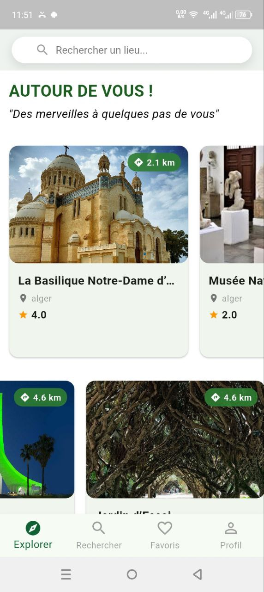
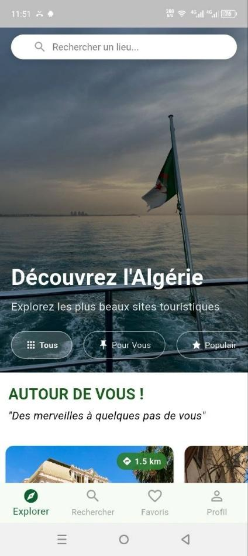
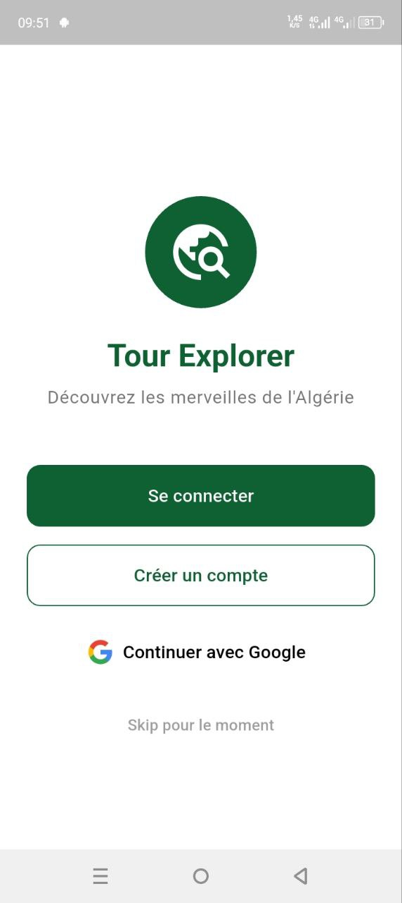

# Discover Algeria 🇩🇿

Une application mobile interactive pour la **découverte et la promotion des sites touristiques en Algérie**.

---

## 📱 Fonctionnalités principales
- 🔍 Recherche de lieux touristiques
- 🗺️ Itinéraires et suggestions de lieux proches
- 🌐 Mode en ligne et hors ligne
- ⭐ Système de notation et commentaires
- ❤️ Gestion des favoris
- 👤 Profil utilisateur et l'authentification

---

## 🛠️ Technologies utilisées
- Flutter
- Firebase (Auth, Firestore, Storage)
- SQLite (mode offline)
- Google Maps API

---

## 🚀 Lancer le projet
```bash
git clone https://github.com/SarahAR-dev/discover-algeria.git
cd discover-algeria
flutter pub get
flutter run


## 📸 Aperçu de l'application







